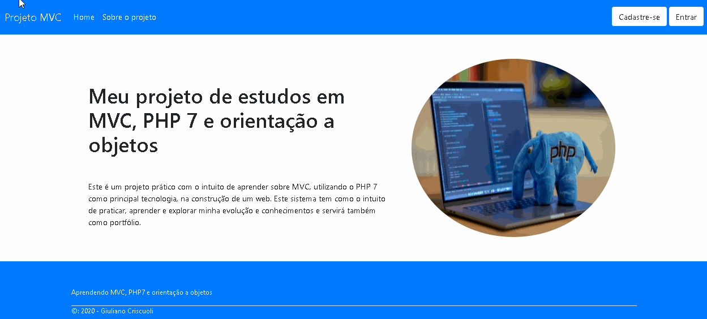

# Projeto: Sistema construído em mvc

 ;

# Descrição

Sistema construído com mvc, utilizando orientação a objetos, com um CRUD, autenticação de usuário e criação de urls amigáveis.

# Tecnologias Utilizadas

Front-end

1. HTML/CSS
2. Javascript
3. Bootstrap

Backend

1. PHP
2. Mysql

# Licença

:book: Licença MIT. 